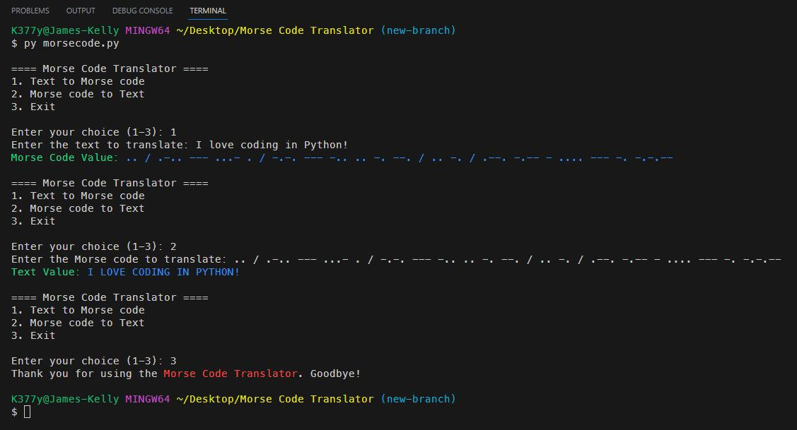

# Morse Code Translator

## *Description*
This Python application can take a word or phrase and translate it to Morse code. It can also do it in reverse and convert the Morse code into text. 
The format is as follows: 
&emsp; - text: `dog and cat` 
&emsp; - morse code: `-.. --- --. / .- -. -.. / -.-. .- -` 
&emsp; - *spaces are used to separate letters and forward slashes are used to separate words*  
 
 

## *Installation & Usage*
To install this app, simply clone the repository and run the `morsecode.py` file in your terminal.
 
When prompted: 
 - Select 1, 2 or 3 
    - Enter the text or morse code you would like to translate 
    - The translated text or morse code will be displayed 
    - You will be prompted to translate again or exit 
    - Note: everything is case insensitive and automatically gets set to uppercase after input 
 

 
 

## *Questions*
<h3>Portfolio:&emsp;<a href="https://jk377y.dev" target="_blank">https://jk377y.dev</a></h3>
<h3>Email:&emsp;<a href="mailto:jk377y@gmail.com" target="_blank">jk377y@gmail.com</a></h3>
<h3>LinkedIn:&emsp;<a href="https://www.linkedin.com/in/james-kelly-software-developer/" target="_blank">https://www.linkedin.com/in/james-kelly-software-developer/</a></h3>
<h3>GitHub:&emsp;<a href="https://github.com/jk377y" target="_blank">https://github.com/jk377y</a></h3>
 
 

## *License*

 Copyright (c) 2023 James Kelly
 Information on this license can be found at: (https://opensource.org/licenses/MIT)